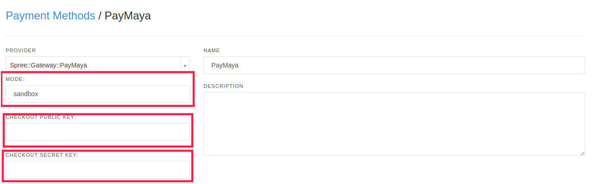

SpreePaymaya
============

[PayMaya](https://paymaya.com/) gateway for SpreeCommerce

## Installation

1. Add this extension to your Gemfile with this line:
  ```ruby
  gem 'spree_paymaya', github: 'oscar6654/spree_paymaya'
  ```

2. Install the gem using Bundler:
  ```ruby
  bundle install
  ```

3. Copy & run migrations
  ```ruby
  bundle exec rails g spree_paymaya:install
  ```

4. Restart your server

  If your server was running, restart it so that it can find the assets properly.

5. Ensure you have Rails secret_key_base

## Setup

1. Go to admin panel and create a new payment method using `Spree::Gateway::Paymaya` provider
2. Puts your API credentials, and set mode `prod` or `sandbox`



## Testing

First bundle your dependencies, then run `rake`. `rake` will default to building the dummy app if it does not exist, then it will run specs. The dummy app can be regenerated by using `rake test_app`.

```shell
bundle
bundle exec rake
```

When testing your applications integration with this extension you may use it's factories.
Simply add this require statement to your spec_helper:

```ruby
require 'spree_paymaya/factories'
```


## Contributing

Copyright (c) 2018 Gonzalo Moreno, released under the New BSD License
